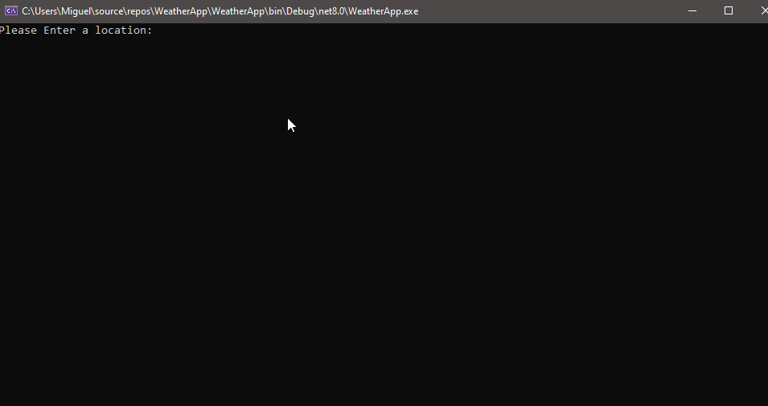

# WeatherApp

A simple C# console app that retrieves the current temperature and "feels like" temperature for any location using:

- **Google Maps Geocoding API** for location-to-lat/lng conversion
- **OpenWeatherMap One Call API** for weather data

---

## Requirements

- .NET 6 or newer
- Google Maps API key
- OpenWeatherMap API key

---

## Setup

1. Clone the repo:
   ```bash
   git clone https://github.com/yourusername/WeatherApp.git
   cd WeatherApp
   ```

2. Set your environment variables:
   ```bash
   set GOOGLEMAPS_APIKEY=your_google_api_key
   set OPENWEATHER_APIKEY=your_openweather_api_key
   ```

   _(Use `export` on macOS/Linux.)_

3. Run the app:
   ```bash
   dotnet run
   ```

---

## Features

- Converts user-entered location to latitude/longitude
- Fetches real-time weather data (temperature + feels like)
- Clean console output
- Basic input validation and error handling

---

## Tech Stack

- C#
- .NET 6
- `HttpClient` for API requests
- `Newtonsoft.Json` for JSON parsing

---

##  Demo



---
